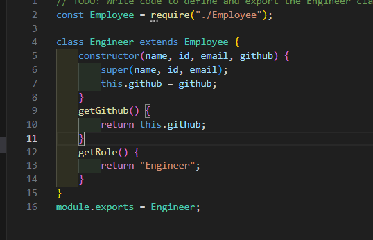
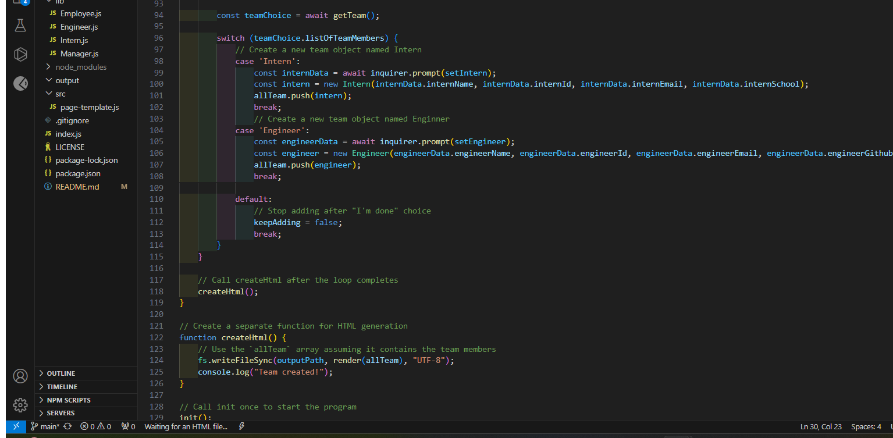
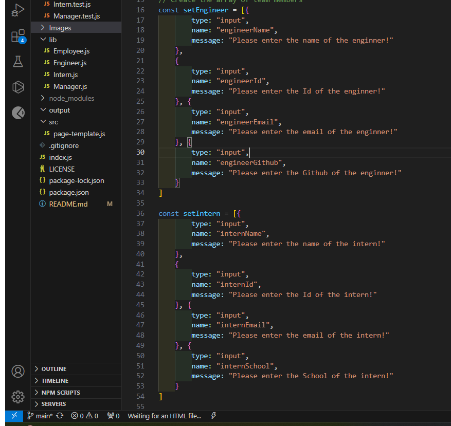
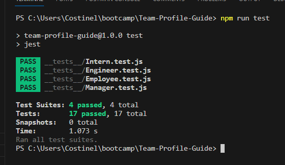
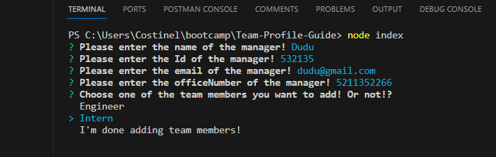
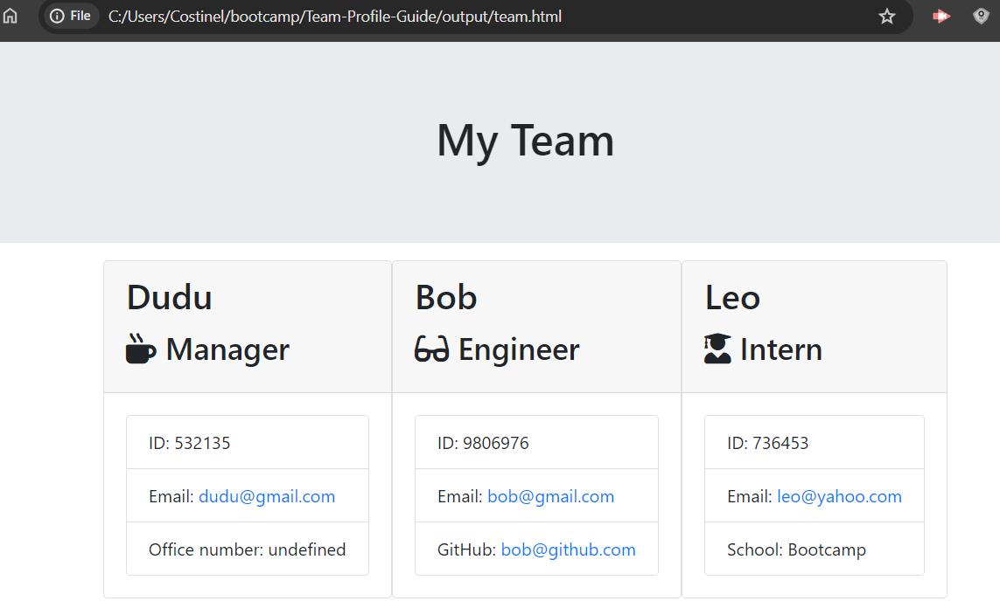

# Team-Profile-Guide
The team profile guide is a guide with quick access to information about the team.
## Description

- Using  tesitng methods to create classes whith more control over the structure.
- Buld an HTML document using just js.
- How to create classes, different methods and functions.

## Installation

https://github.com/Costinel22/Team-Profile-Guide

Clone the repository from github
- install inquirer 8.0.0
- minstal jest
- and run on terminal comand "npm run test" for testing
- and run on terminal comand "node index.js" to imput data
- on the end of the command you should find on output directory a html file.

## Usage

#### On this photo you can se the Engineer class whit constructor and  element  add whit super from Employee 

 

 #### On this photo you can the switcher case what manage to select the choice object.
  

  #### On this photo you can see how an arry whit team member questions are created using a constant expression.
   

## Credits

## License

MIT License

## Tests
#### This image is a test how shows how all of the functions are implemented okay.

#### Inthis image is the terminal where date are introduced.

#### Inthis image is the is the html that shows how all of the functions are implemented.
 
  